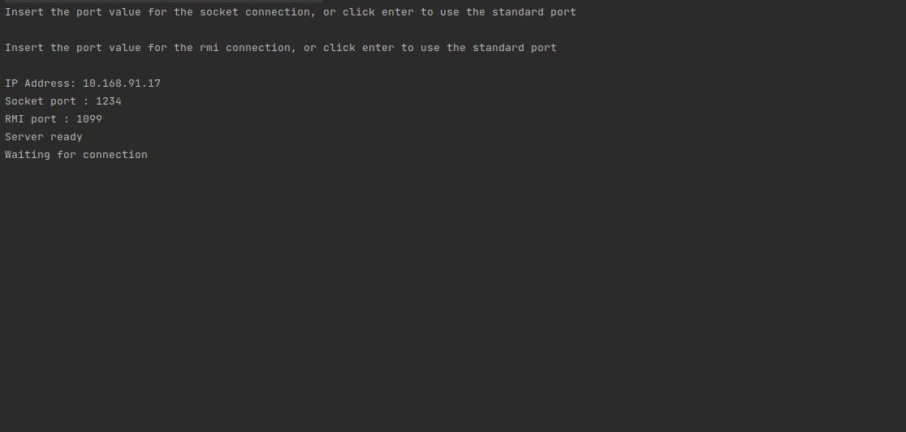
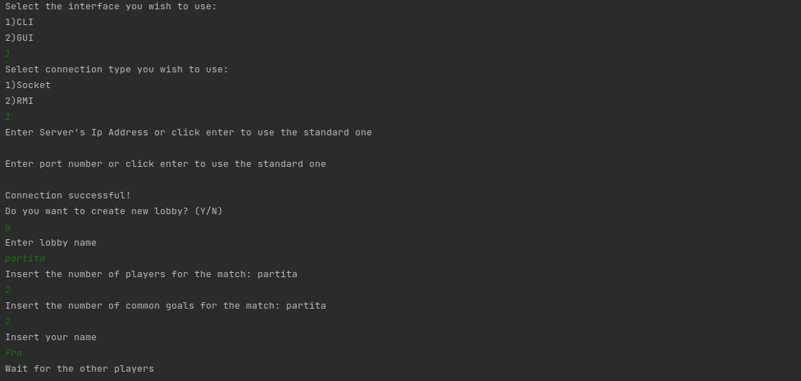
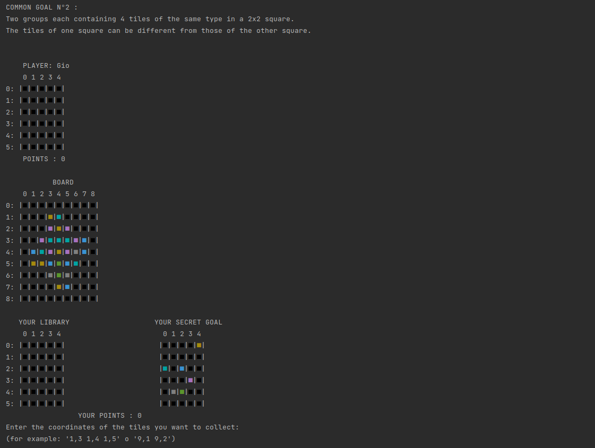
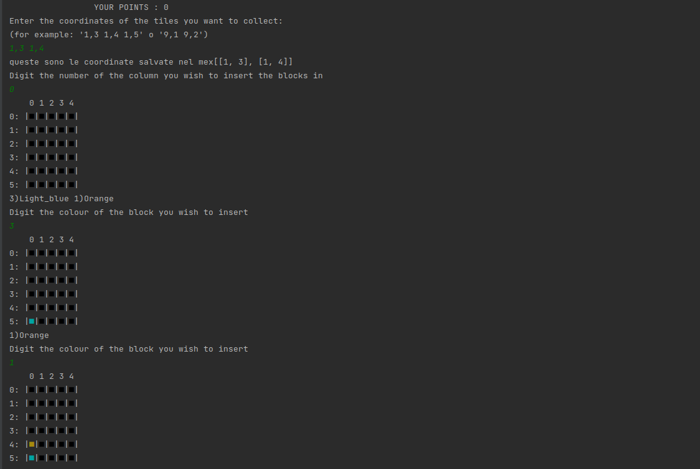
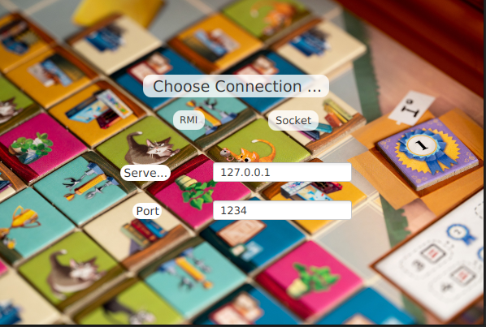
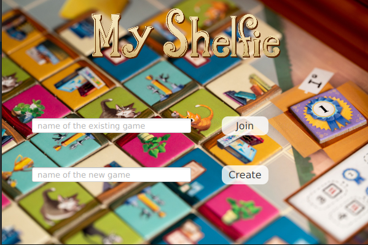
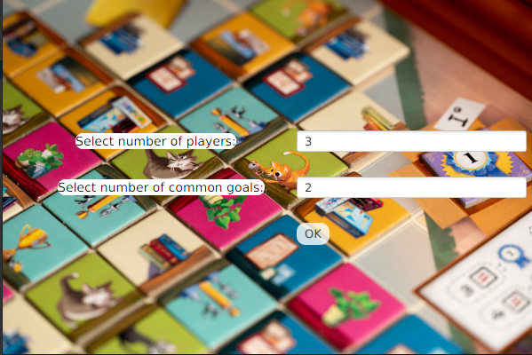
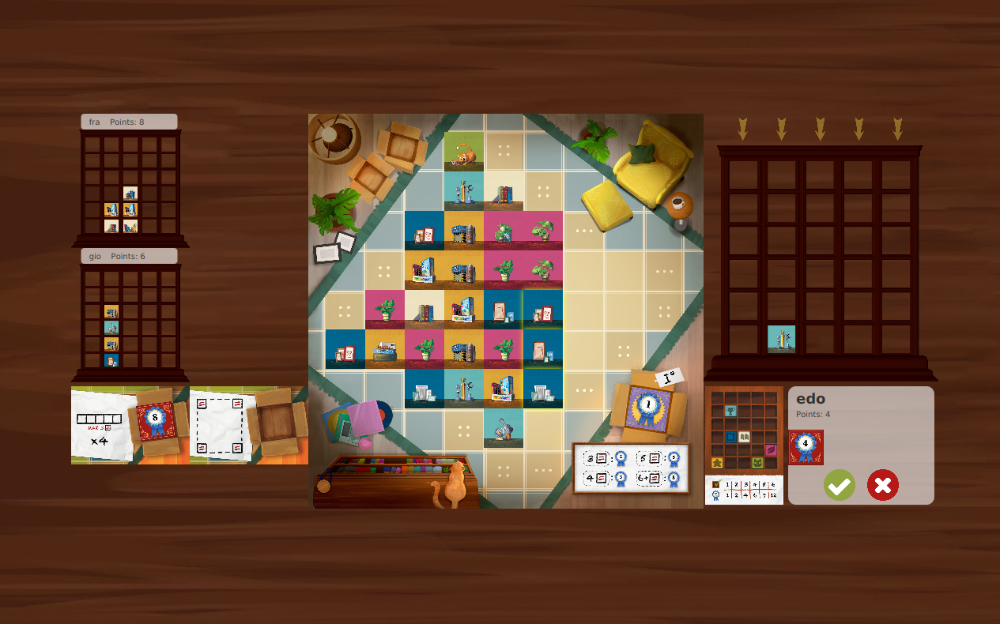
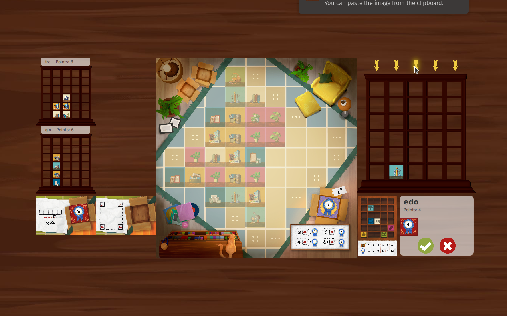
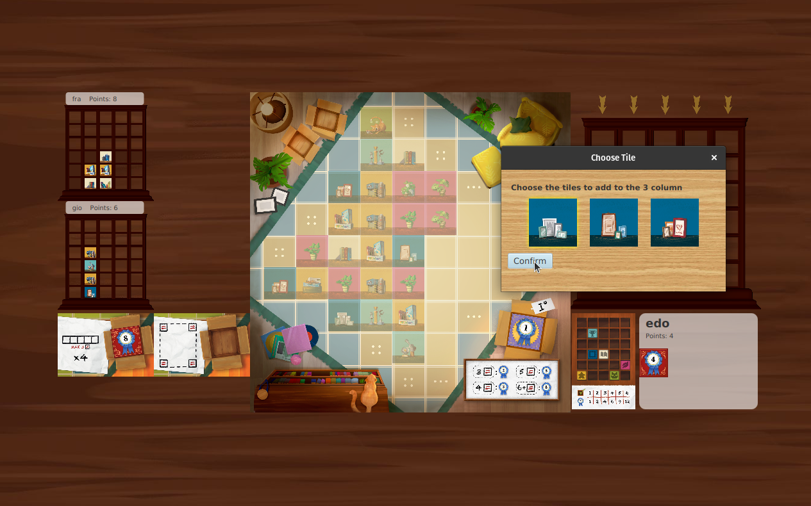

# My Shelfie

## 📘 Overview

**My Shelfie** is a multiplayer board game implemented with a **client-server architecture** and rich **Java OOP design**.

The objective of the game is for the players to take the item tiles from the living room (the board) and place them in their bookshelves (the library) to score points.
Points are assigned when certain patterns of tiles are achieved in the bookshelves. The game ends when a player completely fills their bookshelf.
The player with more points at
the end will win the game. There are 4 ways to score points:
- #### Personal Goal card
- #### Common Goal cards
- #### Adjacent Item tiles
- #### Game-end trigger

The game is divided in turns that take place in order starting from
the first player to connect.
During your turn, you must take 1, 2 or 3 item tiles from the living room board,
following these rules:
The tiles you take must be adjacent to each other and form a straight line.
All the tiles you take must have at least one side free (not touching directly
other tiles) at the beginning of your turn (i.e. you cannot take a tile that
becomes free after your first pick).

---

## ✨ Features

- 🎮 Real-time multiplayer gameplay with server-managed state
- 🧱 Draw and place tiles using coordinate-based selection
- 🗂️ Column-based personal library organization
- 🎯 Private and common goal tracking with point scoring
- ✅ Move validation and board refresh logic
- 🔄 Client-server communication using a custom protocol
- 🔌 Modular MVC architecture with clean separation of concerns

---

## 🗂️ Project Structure

```bash
src/
├── client/              # GUI and client-side controllers
├── server/              # Game logic, rules, and multiplayer server
├── common/              # Shared models, tiles, enums, and protocol messages
├── network/             # Message handler and connection logic
└── utils/               # Utility classes for IO and validation
```

---

## Jar Usage
The game is splitted into two JAR files, both can be downloaded form Deliverables directory.
one Server app instance must be running before the client can actually start playing.
Both server and client app can run on Unix systems (Linux, macOS) or Windows system (on Powershell, cmd and WSL).

## System used
To test the game, we have used mostly Unix systems with JavaFX version 17.0.7, because this version is compatible with the Apple sylicon processor based on the ARM 64 CPU architecture.
To run on windows PC we had to use the argument -Xmx8g.
Also, to see the ANSII colors on the CLI of windows PC we needed to activate the ANSI escape sequences with the command
reg add HKCU\Console /v VirtualTerminalLevel /t REG_DWORD /d 1

### Server Instructions
#### Once the server is initiated it will allow you to specify the ports you wish to use both for the rmi and socket. If not specified 
#### the standard one will be used (1234 socket, 1099 rmi).



### Cli Instructions
#### Once the client is launched it will allow you to choose between the command line interface or the graphic user interface


#### If the cli is selected you will be asked the preferred type of connection, the server ip and port and whether you wish to create or join a game. Again if you don't specify the ip or port standard one will be used(for a local game )



#### After the specified number of players have joined the game will start, just follow the instructions and have fun!




### GUI Instructions
#### Once started the gui will allow you to choose between rmi and socket connection, specify the server ip and port, and then click on the preferred interface



#### Now you will be able to create a new game or join an existing one, insert the name of the lobby and then click the right button



#### Now select the number of players and common goals




### Gameplay

When the colour of the boards become vivid it means is your turn!
Select a maximum of three blocks according to the rules,
they will start to glow, then press the green button to select them.



Once you picked the blocks select one of the arrows above the bookshelf to insert them. Again click the green button to confirm your choice.



You then will be given the option to choose the order for inserting the blocks



Once you have inserted all the blocks your turn will be over
## Advance Functionality


### Multiple games
Once the players have chosen the wished game size, the server will allow a maximum of 3 other players to join. It is possible to create multiple lobby by choosing different names for each one of them.


## Disconnections
If a player is disconnected is able to reenter tha game  he left and by reentering the lobby name in the join selection
and his old nickname in the nickname selection.

---

## 🧰 Requirements

- Java 11+
- JavaFX (for GUI)
- Maven or Gradle (for dependency and build management)

---

## 📄 License

This project is for **academic and educational use** only.  
Redistribution is subject to university policies.


